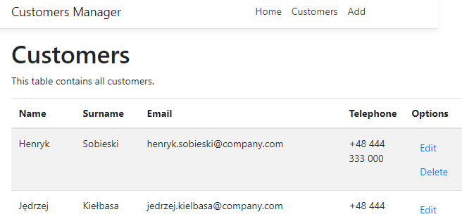

# Introduction
The repository has been created for interview purposes only.
It's a CRUD application made by using dotnet core 2.2, entity framework, ReactJS and PostreSQL database.

## List

## Details

# Technologies

1. Frontend - ReactJS 16.0.0
2. Backend - .Net Core 2.2 + EF
3. Database - PostgreSQL 11

# Installation
(Tested on Windows 10 with `git` and [`cmder`](http://cmder.net/))

1. Install PostgreSQL 11 database on any platform from [here](https://www.postgresql.org/download/windows/).
1. Dotnet Core 2.2 SDK is required. It can be downloaded from [here](https://dotnet.microsoft.com/download/dotnet-core/2.2).
1. Run `npm install` inside `CustomersManagement\ClientApp` directory.
1. Run `dotnet build` to build .net core app.
1. Run `dotnet run` command to run application. It should start on http:\\localhost:5000 but make sure by following the console output.

# IDE

Visual Studio 2017 Community

# Not implemented

1. SSL
2. Authentication
3. Advanced logging
4. Error codes
5. Paging
6. Styles
7. Swagger generated API
8. Validation (only basic)
